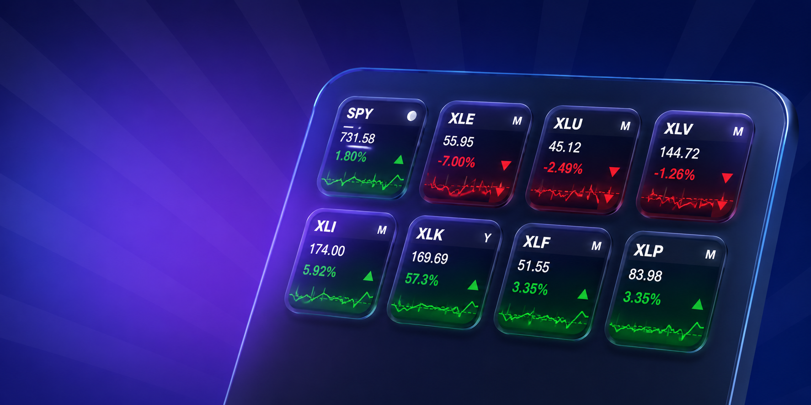

# stock-ticker-stream-deck-plugin

<p align="center">
  
</p>

Stream Deck plugin for stock quotes, provider selection, and multi-view charts, now based on the official Elgato SDK.

## Current capabilities

- provider per key: `Finnhub` or `Yahoo`
- tap-to-cycle views on the device:
  - `1` quote
  - `2` daily chart
  - `3` monthly chart
  - `4` yearly chart
- per-key settings persisted through the official Property Inspector flow
- automatic refresh for configured tiles
- official Elgato SDK runtime with TypeScript + Rollup

## Requirements

- Node.js
- Stream Deck desktop app 7.1+
- `@elgato/cli`

## Development workflow

Install dependencies for the active implementation:

```sh
npm install
```

Use the standard local workflow:

```sh
npm run build
npm run validate
npm run link
```

## Repository layout

- [src](./src): plugin runtime, data providers, and rendering
- [com.exension.stocks.v2.sdPlugin](./com.exension.stocks.v2.sdPlugin): active plugin manifest, assets, and property inspector
- [docs](./docs): repository documentation assets such as preview images
- [package.json](./package.json): plugin build and development scripts

## Notes

- `Yahoo` does not require an API key.
- `Finnhub` requires an API key and some historical endpoints may depend on the account tier.
- The legacy Go implementation has been removed from the repository.

## Known follow-ups

- tighten TypeScript/Node typing in the v2 toolchain
- align `D/M/Y` percentage anchors with stricter financial semantics
